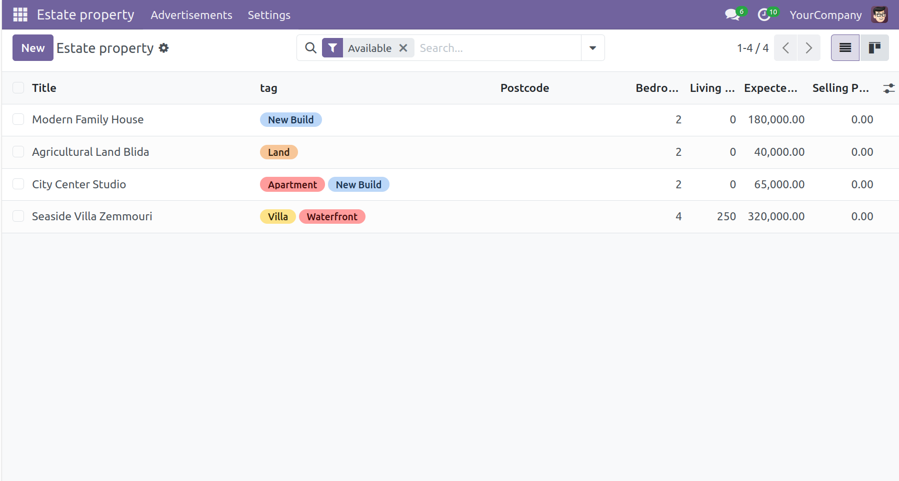
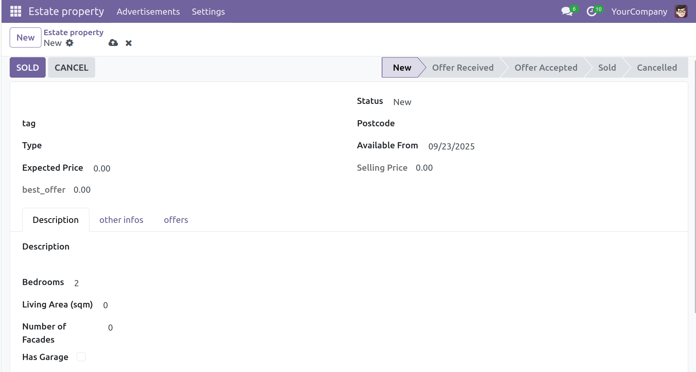

# Odoo Custom Modules – Practice & Learning Portfolio

This repository contains custom Odoo modules developed as part of my hands-on learning journey with the Odoo framework (version 17/18). The goal is to master both backend and frontend (web) development techniques.

---

## 📦 Featured Modules

### 🏠 Real Estate Management
A complete module for managing real estate properties.

**Key Features:**
- Custom models (Property, Offers, Buyers, Tags, etc.)
- Access control and security rules based on user groups
- Business logic (state transitions, price offers, validations)
- Menu items, actions, form views, kanban views

This project follows the structure of the official Odoo tutorial, with enhancements for deeper understanding.

---

## 🎯 Additional Web Practice Modules

To sharpen my frontend and UI development skills, I built several simple modules focused on Odoo's web client:

- **awesome_clicker** – A reactive button counter
- **awesome_dashboard** – Dashboard-style view using kanban/cards
- **awesome_gallery** – Dynamic image grid using web widgets
- **awesome_kanban** – Custom kanban styling and layout testing

Each of these was built to strengthen skills in:
- `t-esc`, `t-if`, `t-foreach` templating
- QWeb views and templates
- Inheritance and view customization
- Client actions and JS basics (where relevant)

---

## ⚙️ Technologies & Tools

- Odoo 17/18 (Community)
- Python 3
- XML/QWeb
- PostgreSQL
- Visual Studio Code
- Git

---
## 🖼️ Screenshots

### 🏠 Property Form View

### 📝 Property Form List

### 🧾 Customized Invoice

## Let's Connect

I'm currently open to freelance opportunities involving:
- Odoo backend customization
- QWeb template design
- Module creation or extension

📧 Feel free to reach out!

